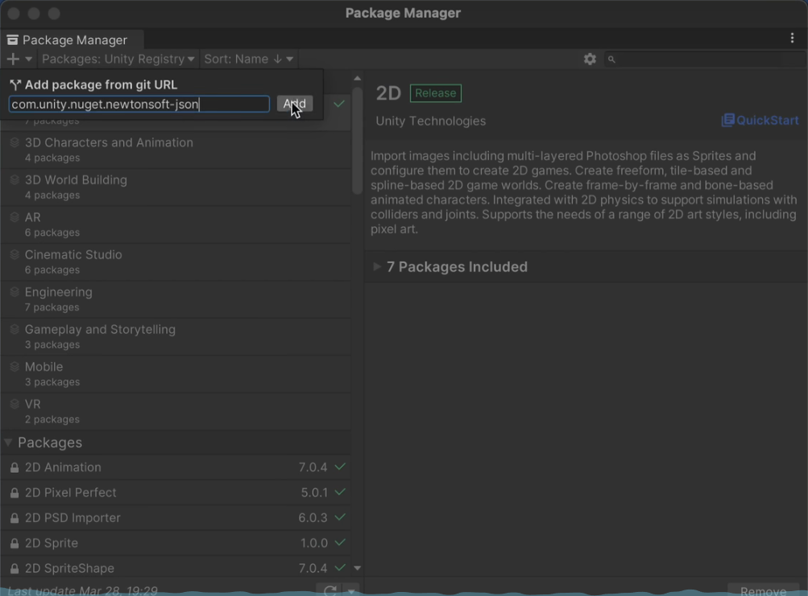

## Camera 组件、视口空间相关

1. 在 unity 空间中，是以 unit 为基本长度单位，默认情况下 1 unit=100 pixels。注意：外部资源、屏幕空间常常以像素为单位；而将外部资源导入进 unity，并且应用到世界空间中时，以 unit 为单位进行计算。

## 物理系统

### AddForce 的两种模式区别

1. Force：需要考虑力的作用时间对速度的影响，即速度 v=(F/m)\*t,在一个物理帧中调用时，一般 t=0.2，因为默认一秒调用 50 次物理帧。
2. Impulse：不需要考虑力作用时间对速度的影响，直接在上述计算公式中，让 t=1s 来得到 v 的值。或者可以理解成直接让速度的增量等于 F/m。

## Unity 新输入系统：InputSystemPackage（适用于跨平台的输入系统）

### 配置

在项目设置中使用最新的输入系统，在 PackageManager 中引入该包，创建配置资源`CreateAsset > InputActions`，命名为``。

### 脚本中引入InputSystem的准备
用上面创建的资源生成C#类

### *脚本中使用的基本方法*
!!! 所有相关资源在开始时都是disable的，需要一次enable
#### 直接使用Asset
```C#
using UnityEngine;
using UnityEngine.InputSystem;

public class ExampleScript : MonoBehaviour
{
    // assign the actions asset to this field in the inspector:
    public InputActionAsset actions;

    // private field to store move action reference
    private InputAction moveAction;

    void Awake()
    {
        // find the "move" action, and keep the reference to it, for use in Update
        moveAction = actions.FindActionMap("gameplay").FindAction("move");

        // for the "jump" action, we add a callback method for when it is performed
        actions.FindActionMap("gameplay").FindAction("jump").performed += OnJump;
    }

    void Update()
    {
        // our update loop polls the "move" action value each frame
        Vector2 moveVector = moveAction.ReadValue<Vector2>();
    }

    private void OnJump(InputAction.CallbackContext context)
    {
        // this is the "jump" action callback method
        Debug.Log("Jump!");
    }

    void OnEnable()
    {
        actions.FindActionMap("gameplay").Enable();
    }
    void OnDisable()
    {
        actions.FindActionMap("gameplay").Disable();
    }
}
```
*引用同一Asset，则控制同一资源*

#### 使用封装类
```C#
using UnityEngine;
using UnityEngine.InputSystem;

public class DocsExampleActionsAssetCsWrapper : MonoBehaviour
{
    // this field will contain the actions wrapper instance
    ExampleActions actions;

    void Awake()
    {
        // instantiate the actions wrapper class
        //实例化control
        actions = new ExampleActions();

        // for the "jump" action, we add a callback method for when it is performed
        //通过回调函数绑定，及监听输入
        actions.gameplay.jump.performed += OnJump;
    }

    void Update()
    {
        // our update loop polls the "move" action value each frame
        Vector2 moveVector = actions.gameplay.move.ReadValue<Vector2>();
    }

    private void OnJump(InputAction.CallbackContext context)
    {
        // this is the "jump" action callback method
        Debug.Log("Jump!");
    }

    void OnEnable()
    {
        actions.gameplay.Enable();
    }
    void OnDisable()
    {
        actions.gameplay.Disable();
    }
}
```
*每个类的实例都是独立的*

### 响应输入常用方法
#### 取值判断
#### 绑定回调

- `Disabled`	The Action is disabled and can't receive input.
- `Waiting`	The Action is enabled and is actively waiting for input.
- `Started`	The Input System has received input that started an Interaction with the Action.
- `Performed`	An Interaction with the Action has been completed.
- `Canceled`	An Interaction with the Action has been canceled.
用例：
` action.performed += ctx => /* Action was performed */;`

### 层级关系
一个Control -> 一个或多个gameplayActions -> 多个action -> 一个或多个boundingInput
Control：资源所创建的C#类，通过enble\disable控制多个gameplayActions激活与关闭
####

### passThrough 和 is initial check
- passThrough:该类型的action，会监听所有绑定的按键，即使也有按键激活。
- is initial check:当该action有输入时，对于其他action，优先处理该输入。

## 脚本组件设计参考

**没有完美的设计！以下仅为参考，请从实际需求出发。先实现，再优雅。**
思想：保证代码的唯一功能性。
各脚本之间的交流，通过获取组件的方式实现，比如：PlayerController 脚本中需要 PhysicsCheck 中的某个值，时，通过 GetComponent<PhysicsCheck>()来获取脚本组件。

### Player 上的脚本设计

#### PlayerController

控制玩家移动（管理玩家位置、速度等）相关代码；（包括角色翻转）
使用 rigidbody 相关内容时，请在 fixedUpdate 中更新，因为 rigidbody 和物理系统相关，且物理系统的更新就是 fixedUpdate。

#### PhysicsCheck

物理检测相关代码。
主要 API：Physics2D

#### PlayerAnimation

管理 Player 动画相关代码；

#### Character

基本属性和响应受伤相关代码；

#### Attack

实现攻击功能

## 编辑器自定义相关

### 特性(Attribute)

#### 描述类 class

- [CreateAssetMenu(fileName = "···", menuName = "···")]
- [RequireComponent(typeof(组件类))] 添加该组件时，额外添加一个组件类
- [System.Serializable] 序列化标记，用于在 Inspector 显示。用于不是继承自 MonoBehaviour 或者 ScriptableObject 的类。

#### 描述字段 field

- [Header("")]
- [Tooltip("")]

### 方法(Methods)

- OnDrawGizmoSelected()

```
OnDrawGizmoSelected(){
    Gizmos.DrawWireSphere(...);
}
```

## 游戏物品数据系统

### 使用 ScriptableObject 基类

这种方式适合于脚本数据不会改变，并且很可能在场景中会有对个实例存在时使用，比如怪物、道具、武器等的基本属性。
对于玩家这种基本属性很可能会变化，并且并不会有多个玩家共用一套属性的情况，不用也不适合使用这个方法。

## 存档系统 与 导入Excel数据（文件读写相关）

#### 使用 JSON 文件

##### 具体实现

- 工具库：[com.unity.nuget.newtonsoft-json](https://www.newtonsoft.com/json)
- 命名空间`using Newtonsoft.Json;`
- 在 unity 项目中引入：
  
  `com.unity.nuget.newtonsoft-json`

###### 常用newtonsoft-json方法

###### 序列化相关

默认只能序列化公共字段和设置了公共 getter 的属性
默认只能反序列化公共字段和设置了公共 setter 的属性
(可通过特性声明来实现私有变量的序列化)
默认对引用类的变量的序列化是深层次的。
!!! 只有在序列化成二进制格式时，才需要使用[System.Serializable]特性，来进行可序列化标记。

###### Unity 接口

- Application.persistentDataPath 文件路径

###### .Net 接口
`using System.IO`

-  File.Exists();
    代码示例：

```C#

```

如何存储引用：用存储唯一身份标识符代替引用，并在加载时通过该标识符对引用的对象进行识别，避免出现加载后引用错误问题。

## 设计模式 与 Unity 中 C#的具体实现以及附加功能

### 泛型单例模式

```C#
public class Singleton<T> : MonoBehaviour where T:Singleton<T>
{
    private static T instance;

    public static T Instance
    {
        get { return instance;}
    }

    protected virtual void Awake()
    {
        if(instance != null)
            Destroy(gameObject);//防止有多个单例，也就是只允许一个实例
        else
            instance = (T)this;//因为在Unity生命周期中，awake是游戏对象被创建后，第一个调用的方法。
    }

    public static bool IsInitialized
    {
        get { return instance != null; }
    }

    protected virtual void OnDestroy()//（单例）被销毁时，清空静态变量
    {
        if(instance == this)
        {
            instance = null;
        }
    }
}
```

## TextMeshPo插件
### 使用简介
需要通过现有字体文件（TTF或OTF格式文件）生成TMP字体资源